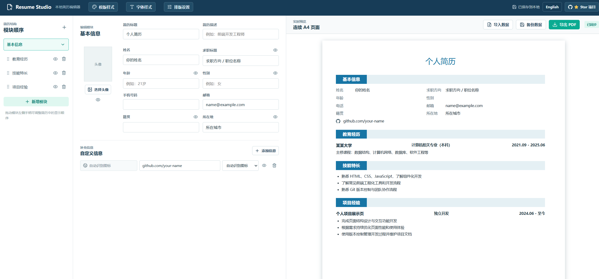

# Resume Studio

[English](README.md) | 简体中文

[](https://github.com/qiqizizzz/Resume-Studio/stargazers)
[](https://github.com/qiqizizzz/Resume-Studio/network/members)
[](https://github.com/qiqizizzz/Resume-Studio/issues)
[](LICENSE)
[](https://github.com/qiqizizzz/Resume-Studio/actions/workflows/deploy.yml)

Resume Studio 是一个本地优先的多页 A4 简历编辑器，将结构化模块、Markdown 内容、实时分页、样式调整和 PDF 导出集中在一个工作区中。

**[打开在线版](https://qiqizizzz.github.io/Resume-Studio/)** · **[查看 GitHub 仓库](https://github.com/qiqizizzz/Resume-Studio)**

<p align="center">
  
</p>

## 功能

Resume Studio 主要提供以下核心能力：

| 功能 | 说明 |
| --- | --- |
| 1. A4 实时预览 | 编辑内容时同步渲染 A4 页面，内容变长后自动分页。 |
| 2. 结构化简历模块 | 在同一个工作区编辑基本信息、教育、技能、工作、项目和自定义模块。 |
| 3. 灵活排版控制 | 拖动调整模块和经历条目顺序，也可以隐藏不需要的可选字段。 |
| 4. Markdown 内容 | 使用 Markdown 编写经历描述，支持列表、加粗和空行等 GFM 语法。 |
| 5. 视觉样式设置 | 调整字体、字号比例、颜色、间距、页面边距、模块样式和头像显示方式。 |
| 6. 本地优先隐私 | 数据保存在桌面应用本地存储或浏览器 `localStorage` 中，不需要简历后端服务。 |
| 7. 数据备份与导入 | 将简历数据导出为 JSON，也可以在其他设备中导入恢复。 |
| 8. PDF 导出 | Electron 桌面版使用原生导出，浏览器版可以将预览打印为 PDF。 |

## 开始使用

### 方法一：直接使用在线版

直接打开[在线版](https://qiqizizzz.github.io/Resume-Studio/)，无需安装任何软件。简历数据会保存在当前浏览器的本地存储中。

### 方法二：部署到本地

建议使用 Node.js 20 或更高版本。

```bash
npm install
npm run dev
```

开发命令会同时启动 Vite 服务和 Electron 窗口。

需要时可以执行构建和代码检查：

```bash
npm run build
npm run lint
```

打包 Windows 安装程序：

```bash
npm run dist:win
```

安装包会生成在 `release/` 目录。

## 数据与导出

简历内容默认保存在本地。桌面版使用 Electron 本地应用数据目录，浏览器版使用 `localStorage`，不会把简历内容上传到项目服务器。

浏览器版导出时，请在系统打印窗口选择“另存为 PDF”；Electron 桌面版使用原生 PDF 导出流程。

## 许可证

本项目使用 [MIT License](LICENSE)。第三方依赖和图标资源仍遵循各自的许可证。
